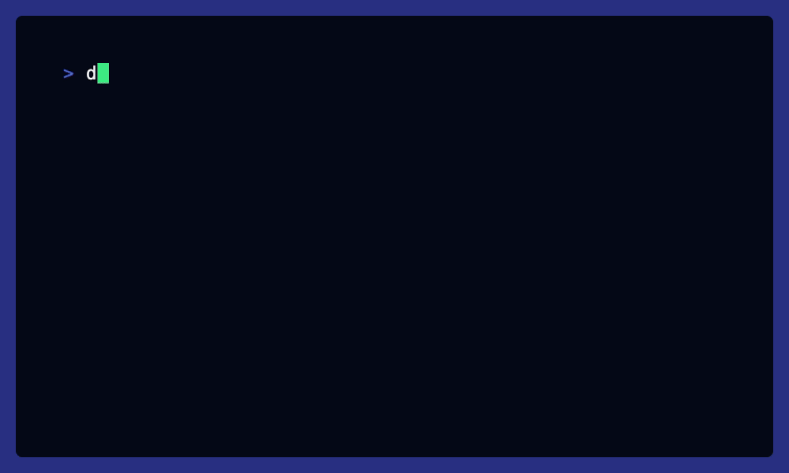
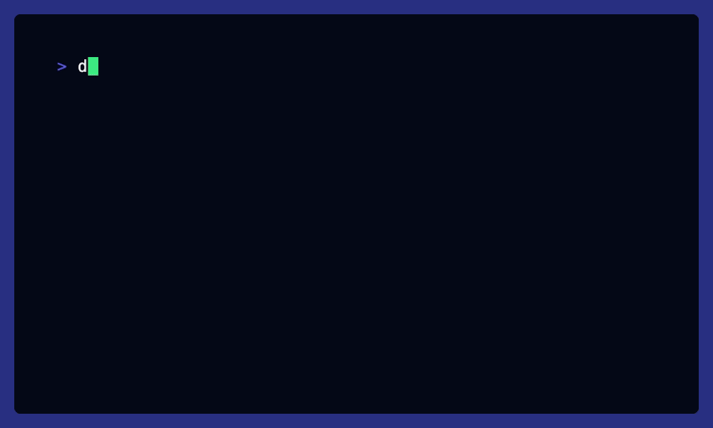

# Examples

These examples depend on a running instance of the Command integration package.

## Connections

Command connections for use in examples.

### Command

Connect to the Command integration.

#### Local command execution (relative to the running integration)

```shell
dtkt create connection command -f examples/configs/local.json --intgr command
```


#### OR - Remote command execution (SSH)

```shell
dtkt create connection command -f examples/configs/remote.json --intgr command
```



## Services

### CommandService

#### ExecuteCommand

Execute a single command.

```shell
dtkt call ExecuteCommand \
  --conn command \
  -f examples/command-service/execute-command/input.json
```


#### ExecuteStreamedCommand

Execute a single command with streaming input and output.

```shell
dtkt call ExecuteStreamedCommand \
  --conn command \
  -f examples/command-service/execute-streamed-command/inputs.jsonl
```



#### ExecuteCommands

Execute a stream of commands.

```shell
dtkt call ExecuteCommands \
  --conn command \
  -f examples/command-service/execute-commands/inputs.jsonl
```


#### ExecuteBatchCommands

Execute multiple commands as a batch.

```shell
dtkt call ExecuteBatchCommands \
  --conn command \
  -f examples/command-service/execute-batch-commands/input.json
```


#### ExecuteShellCommand

Execute a single shell command.

```shell
dtkt call ExecuteShellCommand \
  --conn command \
  -f examples/command-service/execute-shell-command/input.json
```


#### ExecuteStreamedShellCommand

Execute a single shell command with streaming input and output.

```shell
dtkt call ExecuteStreamedShellCommand \
  --conn command \
  -f examples/command-service/execute-streamed-shell-command/input.json
```


#### ExecuteShellCommands

Execute a stream of shell commands.

```shell
dtkt call ExecuteShellCommands \
  --conn command \
  -f examples/command-service/execute-shell-commands/inputs.jsonl
```


#### ExecuteBatchShellCommands

Execute multiple shell commands as a batch.

```shell
dtkt call ExecuteBatchShellCommands \
  --conn command \
  -f examples/command-service/execute-batch-shell-commands/input.json
```


#### TerminalSession

Start a terminal session and stream raw input/output.

```shell
dtkt call TerminalSession \
  --conn command \
  -f examples/command-service/terminal-session/inputs.jsonl
```


## Flows

### Coming soon!
