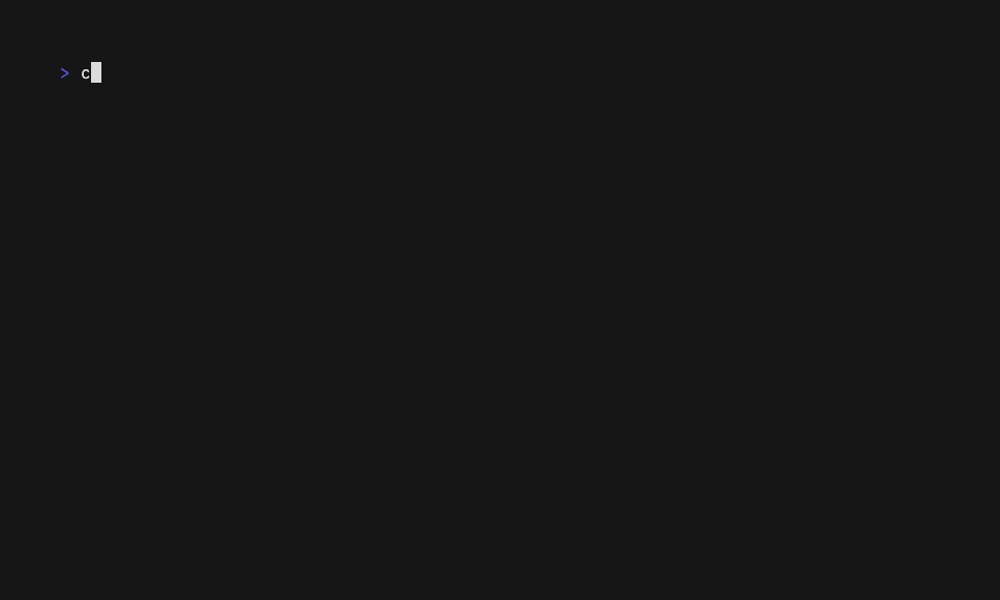

# Examples

These examples depend on a running instance of the Postmark integration package.
Unless you are running a Postmark sandbox server, these emails will get sent to real email addresses.

The `to` user in these examples is set to `shadi@withdatakit.com` our CTO.
He'll be happy to receive your emails, but please don't spam him! 😉

## Connections

Postmark connections for use in examples.

### Postmark

Connect to the Postmark integration.

```shell
ACCOUNT_API_KEY=replace SERVER_API_KEY=me envsubst '$ACCOUNT_API_KEY,$SERVER_API_KEY' < examples/configs/postmark.envsubst.json > examples/configs/postmark.json
dtkt create connection postmark -f examples/configs/postmark.json --intgr postmark
```


## Services

### EmailService

#### SendEmail

Send a single email.

```shell
dtkt call SendEmail \
  --conn postmark \
  -f examples/email-service/send-email/input.json
```


#### SendEmails

Send a stream of emails.

```shell
dtkt call SendEmails \
  --conn postmark \
  -f examples/email-service/send-emails/inputs.jsonl
```


#### SendBatchEmail

Send multiple emails as a batch.

```shell
dtkt call SendBatchEmail \
  --conn postmark \
  -f examples/email-service/send-batch-email/input.json
```


#### SendEmailWithTemplate

Send a single email using a template.

```shell
dtkt call SendEmailWithTemplate \
  --conn postmark \
  -f examples/email-service/send-email-with-template/input.json
```



#### SendEmailsWithTemplate

Send a stream of emails using a template.

```shell
dtkt call SendEmailsWithTemplate \
  --conn postmark \
  -f examples/email-service/send-emails-with-template/inputs.jsonl
```


#### SendBatchEmailWithTemplate

Send multiple emails using a template as a batch.

```shell
dtkt call SendBatchEmailWithTemplate \
  --conn postmark \
  -f examples/email-service/send-batch-email-with-template/input.json
```


#### ListEmailTemplates

List all email templates.

```shell
dtkt call ListEmailTemplates \
  --conn postmark \
  -f examples/email-service/list-email-templates/input.json
```


#### GetEmailTemplate

Get an email template by its ID (this is mapped to the `Alias` field in Postmark).

```shell
dtkt call GetEmailTemplate \
  --conn postmark \
  -f examples/email-service/get-email-template/input.json
```


#### CreateEmailTemplate

Create an email template.

```shell
dtkt call CreateEmailTemplate \
  --conn postmark \
  -f examples/email-service/create-email-template/input.json
```


#### UpdateEmailTemplate

Update an email template.

```shell
dtkt call UpdateEmailTemplate \
  --conn postmark \
  -f examples/email-service/update-email-template/input.json
```


#### DeleteEmailTemplate

Delete an email template.

```shell
dtkt call DeleteEmailTemplate \
  --conn postmark \
  -f examples/email-service/delete-email-template/input.json
```


### ActionService

#### ListActions

List all available actions.

```shell
dtkt call ListActions \
  --conn postmark \
  -f examples/action-service/list-actions/input.json
```


#### GetAction

Get details of a specific action.

```shell
dtkt call GetAction \
  --conn postmark \
  -f examples/action-service/get-action/input.json
```


#### ExecuteAction

##### Example

Execute an example action.

```shell
dtkt call ExecuteAction \
  --conn postmark \
  -f examples/action-service/execute-action/example/input.json
```


